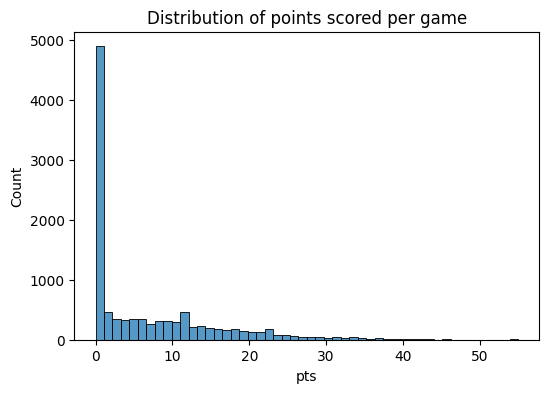
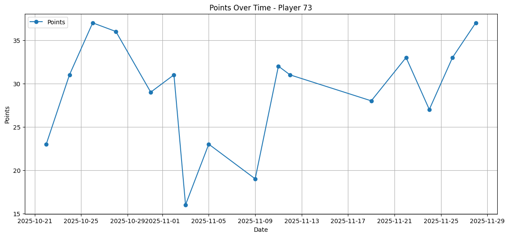
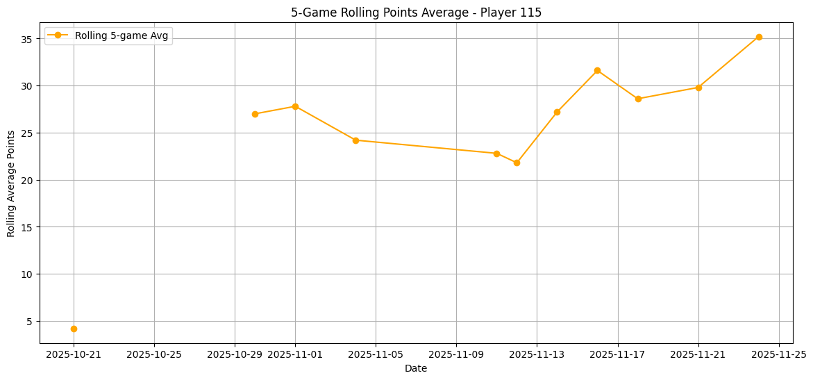
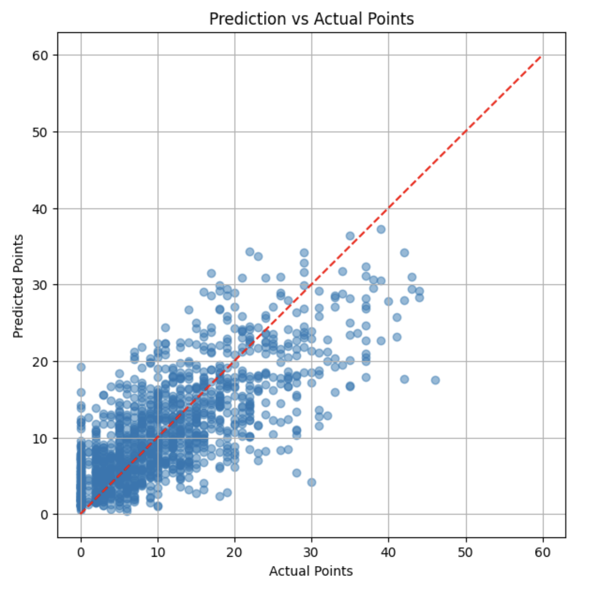
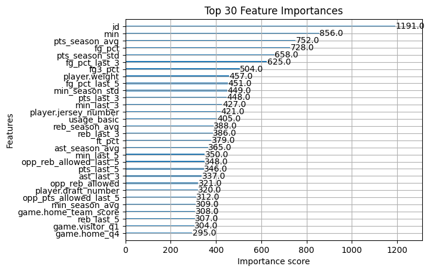
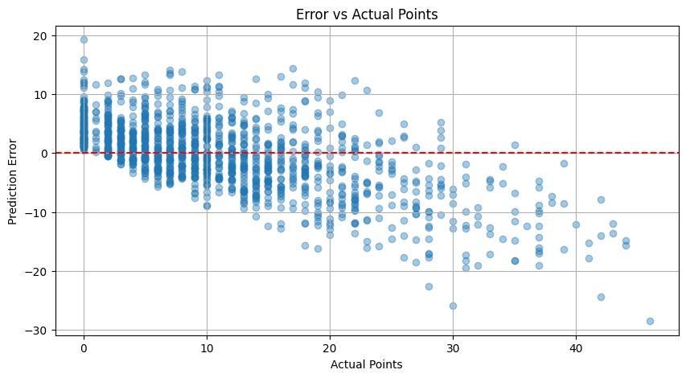
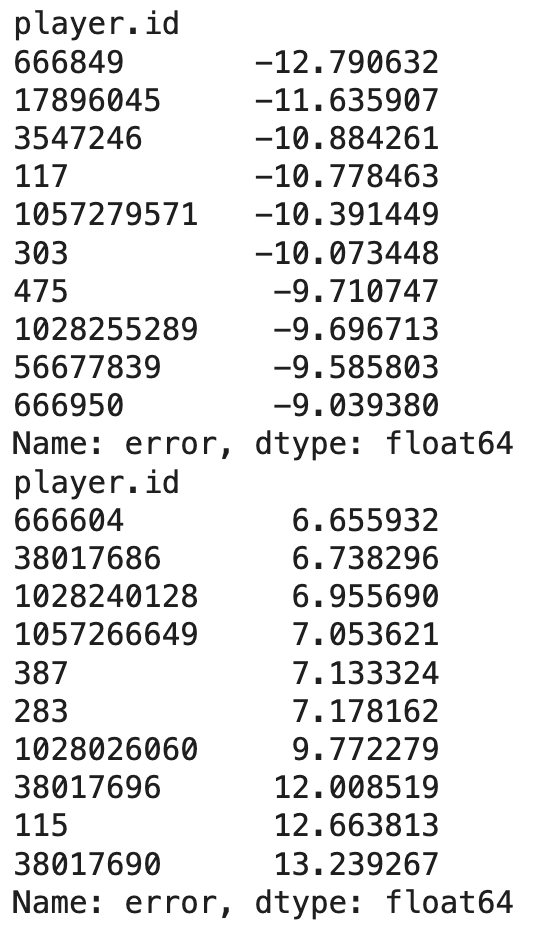

# NBA Next-Game Points Prediction

A time-aware machine-learning project that estimates how many points an NBA player will score in their next game using recent box-score performance and matchup context.

## Overview

The project builds an end-to-end regression workflow from NBA player-game statistics:

1. Collect and clean player-game box scores from the [balldontlie API](https://www.balldontlie.io/).
2. Explore data quality, missingness, and scoring distributions.
3. Build lagged, rolling, rest, usage, and opponent-context features without using information from the target game.
4. Train an XGBoost regressor with a chronological train/test split.
5. Evaluate predictions with RMSE and inspect feature importance and player-level error patterns.

The target variable, `next_pts`, is the points scored by a player in their following game.

## Data

The included `raw_data.csv` is a reproducible snapshot of NBA player-game statistics collected for the 2025 season between October 1 and December 1. Source data comes from the balldontlie `stats` endpoint.

The snapshot contains 10,779 player-game observations. It includes conventional box-score metrics, player and team identifiers, and game metadata. Player-game duplicates are removed and minutes are normalized before modeling.

## Exploratory analysis

Data-quality checks found high completeness across most fields. Overtime-related fields are often missing because overtime games are uncommon, rather than because of a broader data-integrity issue. Points and minutes are both strongly right-skewed: most player-game rows have lower scoring totals, while high-usage performances form a long tail. The 90th, 95th, and 99th percentiles of points are 20, 25, and 35, respectively, confirming that the largest scoring outputs are rare but valid observations.



## Method

The model uses an XGBoost regressor and a chronological holdout split to mirror a real prediction setting and avoid future-data leakage. Features include:

- Three-, five-, and ten-game rolling averages for points, rebounds, assists, field-goal percentage, and minutes.
- Season scoring, rebounding, assist, and minutes baselines.
- Days of rest and a rolling usage proxy.
- Leakage-safe rolling opponent allowances and estimated opponent pace.

Past-game features are shifted before use. Current-game box-score columns and identifiers are excluded from the training feature set.

### Player-form features

Recent player performance is a central signal in the model. The examples below show a player's observed scoring series and the five-game rolling-points feature used to describe recent form.





## Results and interpretation

Model performance is assessed with root mean squared error (RMSE) on the held-out chronological test period. Prediction-versus-actual diagnostics show how closely estimates track observed next-game scoring. The model is generally strongest in typical scoring ranges; rare, extreme scoring performances are more difficult because they depend on contextual factors that box scores alone do not fully capture.



Feature importance emphasizes recent performance and playing-time variables, reflecting that form and opportunity are major drivers of next-game scoring.



Error analysis is performed both by player and by scoring outcome. Players with volatile roles or uncertain minutes can be systematically under- or over-predicted. Prediction errors also spread more widely at high actual scoring totals.





## Repository contents

| File | Purpose |
| --- | --- |
| `01_eda.py` | Fetches, cleans, and explores player-game statistics; can export a new data snapshot. |
| `02_modeling.py` | Engineers features, trains the XGBoost model, evaluates predictions, and produces diagnostic plots. |
| `raw_data.csv` | Included cleaned data snapshot used by the modeling script. |
| `requirements.txt` | Python dependencies. |

## Getting started

Requires Python 3.10 or later.

```bash
git clone https://github.com/friedporkdumplings/nba-next-game-points-prediction.git
cd nba-next-game-points-prediction
python -m venv .venv
source .venv/bin/activate
pip install -r requirements.txt
```

To reproduce the included model and diagnostics:

```bash
python 02_modeling.py
```

To collect a fresh dataset first, create a balldontlie API key and provide it as an environment variable:

```bash
export BALLDONTLIE_API_KEY="your_api_key"
python 01_eda.py
```

The collection script writes a new snapshot to `data/raw_data.csv`. Copy or move it to the repository root as `raw_data.csv` before running the modeling script, or update the input path in `02_modeling.py`.

## Limitations and next steps

This baseline is intentionally focused on recent box-score data. It does not model injuries, starting-lineup changes, betting markets, or richer game context. These signals, together with more current-season observations and hyperparameter tuning, are promising directions for improving predictions—particularly for volatile roles and unusually high-scoring games.

## Authors

Jae Huang and Hanzhe Jiang

## Data and API access

The data collection code uses the balldontlie API. Obtain and manage your own API credentials, and never commit them to the repository.
